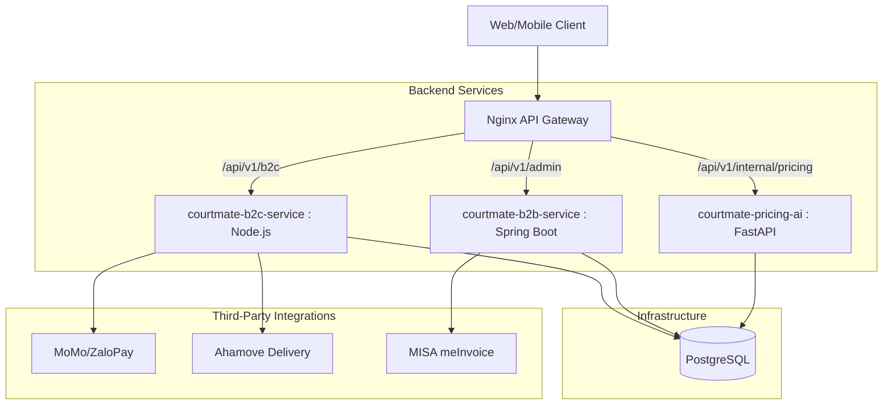

# 🏸 CourtMate — Sports Court Booking Platform

[](https://nextjs.org/)
[](https://nodejs.org/)
[](https://spring.io/projects/spring-boot)
[](https://fastapi.tiangolo.com/)
[](https://www.postgresql.org/)
[](https://www.docker.com/)

**CourtMate** is a high-performance, multi-service platform for sports court booking (Pickleball, Badminton, Tennis). It features a microservices architecture designed to scale, with a modern frontend, specialized backends for consumers and business owners, and an AI-driven dynamic pricing engine.

---

## 🏗️ Architecture Overview

CourtMate uses a modular architecture where each service handles a specific business domain. An **Nginx API Gateway** orchestrates all incoming traffic to the appropriate backend.



---

## 📁 Project Structure

| Folder | Tech Stack | Role |
| :--- | :--- | :--- |
| [`/courtmate-web`](./courtmate-web) | Next.js, TailWindCSS | Frontend for customers and admins. |
| [`/courtmate-b2c-service`](./courtmate-b2c-service) | Node.js, Express, Prisma | Handles customer searches, bookings, and payments. |
| [`/courtmate-b2b-service`](./courtmate-b2b-service) | Java, Spring Boot, JPA | Handles venue management, staff operations, and invoicing. |
| [`/courtmate-pricing-ai`](./courtmate-pricing-ai) | Python, FastAPI, Scikit-learn | AI engine for dynamic pricing based on occupancy and demand. |
| [`nginx.conf`](./nginx.conf) | Nginx | API Gateway configuration. |
| [`docker-compose.yml`](./docker-compose.yml) | Docker | Orchestration for local development environment. |

---

## 🚀 Getting Started

### Prerequisites

- [Docker Desktop](https://www.docker.com/products/docker-desktop/) (Running)
- [Node.js 20+](https://nodejs.org/)
- [Java 17+](https://adoptium.net/)
- [Python 3.10+](https://www.python.org/)

### 1. Run via Docker Compose (Cách tối ưu cho lần đầu chạy)

Cách đơn giản nhất để khởi chạy toàn bộ 6 dịch vụ (bao gồm cả DB, Gateway, Frontend, B2B, B2C, AI Pricing) chỉ với một lệnh duy nhất:

```bash
docker-compose up -d --build
```

> **Lưu ý:** Lần chạy đầu tiên sẽ mất chút thời gian để Docker tải các image (Node, Java, Postgres) và build các service.

Sau khi chạy xong, bạn có thể truy cập các dịch vụ tại:

| Dịch vụ | URL Nội bộ / Truy cập |
| :--- | :--- |
| **Frontend Web** | `http://localhost:3001` (Trang chính cho người dùng & Admin) |
| **API Gateway** | `http://localhost/api/v1` (Điều phối mọi request) |
| **B2C Service** | `http://localhost:3000` (Node.js) |
| **B2B Service** | `http://localhost:8081` (Spring Boot) |
| **AI Pricing** | `http://localhost:8000` (FastAPI) |
| **Database** | `localhost:5432` (PostgreSQL) |

Để dừng toàn bộ hệ thống, bạn chỉ cần gõ:
```bash
docker-compose down
```

### 2. Manual Development Setup

If you need to run services individually for development:

#### **A. Database Setup**
Start only the PostgreSQL container:
```bash
docker-compose up -d db
```
The database will be automatically initialized using [`init_db.sql`](./init_db.sql).

#### **B. B2C Service (Node.js)**
```bash
cd courtmate-b2c-service
npm install
npm run dev
```

#### **C. B2B Service (Spring Boot)**
```bash
cd courtmate-b2b-service
./mvnw spring-boot:run
```

#### **D. AI Pricing (FastAPI)**
```bash
cd courtmate-pricing-ai
python3 -m venv venv && source venv/bin/activate
pip install -r requirements.txt
uvicorn app.main:app --port 8000 --reload
```

---

## 📖 Documentation & Testing

- **API Reference**: Detailed endpoint documentation can be found in [`api-document.md`](./api-document.md).
- **Postman Collection**: Import [`postman_collection.json`](./postman_collection.json) to quickly test all API endpoints through the Gateway.

---

## 🛠️ Features

- **Dynamic Pricing**: AI-powered price adjustments based on real-time court occupancy.
- **Smart Admin**: Grid-view calendar for staff to manage bookings and maintenance slots.
- **Micro-animations**: Premium UX with smooth transitions and interactive elements.
- **Integrations**: Ready for MoMo payment gateway, Ahamove delivery, and MISA electronic invoicing.

---

## Quy trình phát triển

### Nguyên tắc chung
- Luôn làm việc trên branch riêng, không code trực tiếp vào main.
- Đồng bộ code mới nhất trước khi làm.
- Mỗi service = 1 branch chính (có thể chia nhỏ thêm nếu cần).

### Quy trình chuẩn

#### Bước 1: Pull code mới nhất
Trước khi làm bất kỳ task nào:
```bash
git checkout main
git pull origin main
```

#### Bước 2: Tạo branch theo service
Định dạng: `git checkout -b <service-name>/<feature-name>`

Ví dụ:
- `git checkout -b booking-service/lock-slot`
- `git checkout -b venue-service/crud-venue`
- `git checkout -b auth-service/mfa`

Hoặc đơn giản hơn:
- `git checkout -b booking-service`
- `git checkout -b venue-service`
- `git checkout -b auth-service`

#### Bước 3: Code & commit
```bash
git add .
git commit -m "feat: implement lock slot API"
```

Quy tắc commit:
- `feat`: thêm feature
- `fix`: sửa bug
- `refactor`: tối ưu code
- `chore`: linh tinh

#### Bước 4: Push branch lên remote
```bash
git push origin <branch-name>
```

#### Bước 5: Tạo Pull Request -> main
Title rõ ràng: `[Booking Service] Lock Slot API`
Mô tả:
- API đã làm
- Test case
- Ảnh (nếu có)

#### Bước 6: Sau khi merge
```bash
git checkout main
git pull origin main
git branch -d <branch-name>
git push origin --delete <branch-name>
```

### Quy định quan trọng (Team phải tuân thủ)

#### Không được:
- Push trực tiếp vào main.
- Commit code chưa chạy được.
- Tạo PR khi chưa test.

#### Bắt buộc:
- Pull main trước khi code.
- Giải quyết conflict trước khi PR.
- Code phải chạy thành công ở local.

### Gợi ý nâng cấp
Có thể dùng cách đặt tên chuẩn hơn:
- `feature/booking-lock-slot`
- `bugfix/payment-timeout`
- `hotfix/double-booking`

---

## License

© 2025 CourtMate Platform. Built with ❤️ for the Sports Community.
